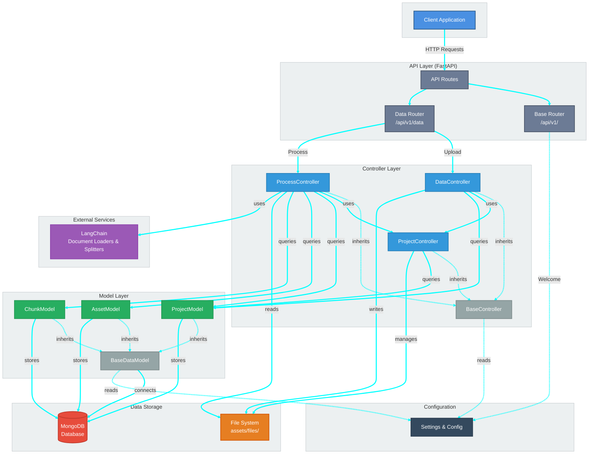
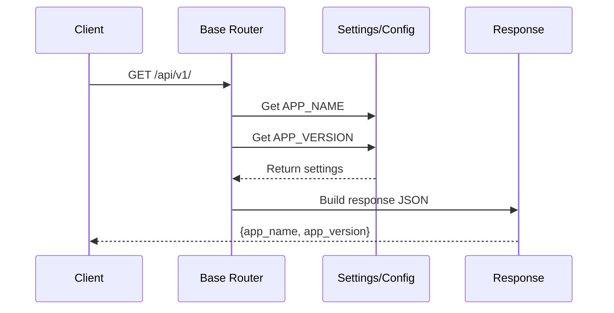
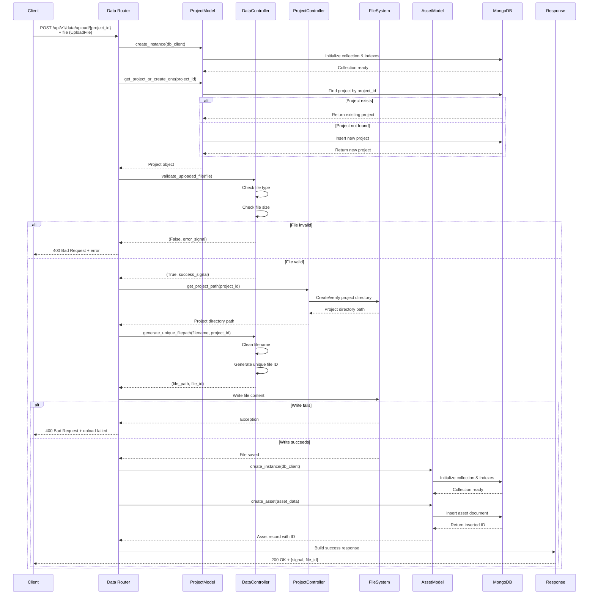
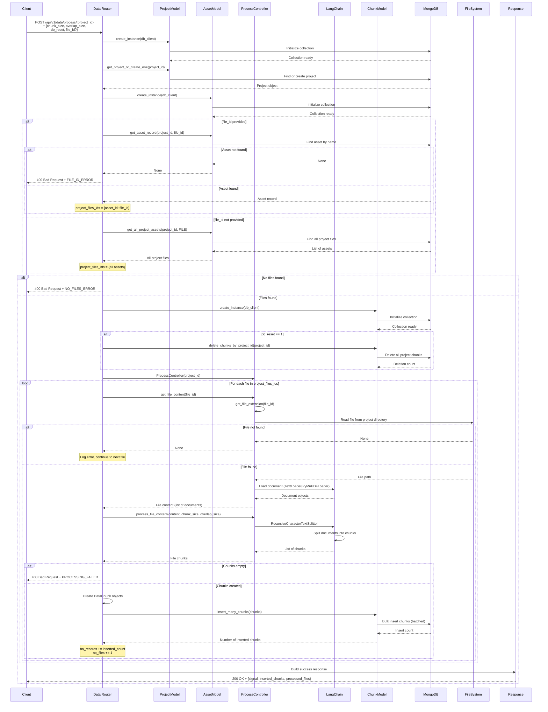

# System Architecture Documentation

This document provides a comprehensive overview of the mini-rag system architecture, including high-level system design and detailed API flow diagrams.

## Table of Contents

1. [High-Level System Architecture](#high-level-system-architecture)
2. [API Flow Diagrams](#api-flow-diagrams)
   - [Welcome Endpoint](#1-welcome-endpoint)
   - [Upload Data Endpoint](#2-upload-data-endpoint)
   - [Process Data Endpoint](#3-process-data-endpoint)
3. [Assumptions](#assumptions)

---

## High-Level System Architecture

The mini-rag system follows a **Model-View-Controller (MVC)** architecture pattern, built on FastAPI framework. The system is designed to handle document uploads, processing, and chunking for Retrieval-Augmented Generation (RAG) applications.

### Architecture Components

#### **API Layer (Routes)**
- **Base Router** (`/api/v1/`): Handles welcome/health check endpoints
- **Data Router** (`/api/v1/data`): Handles data upload and processing endpoints

#### **Controller Layer**
- **BaseController**: Provides common functionality (file paths, random string generation)
- **DataController**: Handles file validation, file path generation, and file name sanitization
- **ProcessController**: Manages document loading (PDF/TXT) and text chunking using LangChain
- **ProjectController**: Manages project directory structure and file organization

#### **Model Layer**
- **BaseDataModel**: Base class for all database models, provides MongoDB connection
- **ProjectModel**: Manages project entities in MongoDB
- **AssetModel**: Manages file assets metadata in MongoDB
- **ChunkModel**: Manages text chunks stored in MongoDB

#### **Data Storage**
- **MongoDB**: Stores projects, assets, and chunks metadata
- **File System**: Stores uploaded files in `assets/files/{project_id}/` directory structure

#### **External Services**
- **LangChain**: Provides document loaders (PDF, TXT) and text splitters for chunking

---

## API Flow Diagrams

### 1. Welcome Endpoint

**Endpoint:** `GET /api/v1/`

This endpoint provides basic application information (name and version).

**Flow Description:**
1. Client sends GET request to `/api/v1/`
2. Router retrieves application name and version from configuration
3. Router returns JSON response with application metadata

---

### 2. Upload Data Endpoint

**Endpoint:** `POST /api/v1/data/upload/{project_id}`

This endpoint handles file uploads, validates files, stores them on the filesystem, and records metadata in the database.

**Flow Description:**
1. **Project Management**: Router creates/retrieves project from database
2. **File Validation**: DataController validates file type and size
3. **Path Generation**: ProjectController ensures project directory exists, DataController generates unique file path
4. **File Storage**: File is written to filesystem in project-specific directory
5. **Metadata Storage**: AssetModel creates asset record in MongoDB with file metadata
6. **Response**: Returns success signal and file ID, or error if any step fails

**Key Components:**
- **ProjectModel**: Manages project lifecycle (create if not exists)
- **DataController**: Validates files and generates unique file paths
- **ProjectController**: Manages project directory structure
- **AssetModel**: Stores file metadata in database

---

### 3. Process Data Endpoint

**Endpoint:** `POST /api/v1/data/process/{project_id}`

This endpoint processes uploaded files by loading them, splitting into chunks, and storing chunks in the database for RAG operations.

**Flow Description:**
1. **Project Validation**: Router retrieves or creates project
2. **File Selection**: 
   - If `file_id` provided: Fetch specific file asset
   - If not provided: Fetch all project files
3. **Reset Option**: If `do_reset=1`, delete existing chunks for the project
4. **File Processing Loop**:
   - Load file content using LangChain loaders (PDF or TXT)
   - Split content into chunks using RecursiveCharacterTextSplitter
   - Create DataChunk objects with metadata
   - Bulk insert chunks into MongoDB
5. **Response**: Returns success signal with counts of inserted chunks and processed files

**Key Components:**
- **ProcessController**: Handles document loading and chunking logic
- **LangChain**: Provides document loaders (TextLoader, PyMuPDFLoader) and text splitters
- **ChunkModel**: Manages chunk storage with batch insertion
- **AssetModel**: Retrieves file metadata for processing

**Processing Parameters:**
- `chunk_size`: Size of each text chunk (default: 100)
- `overlap_size`: Overlap between chunks (default: 20)
- `do_reset`: Whether to delete existing chunks before processing (0 or 1)
- `file_id`: Optional specific file to process, or process all files if omitted

---

## Important Considerations

1. **Database Connection**: MongoDB connection is established at application startup and stored in `app.db_client` for use across all requests.

2. **File Storage**: Files are stored in a local filesystem structure under `src/assets/files/{project_id}/` with unique file IDs to prevent naming conflicts.

3. **Supported File Types**: The system supports PDF and TXT files based on the ProcessController implementation. File type validation is handled in DataController using configuration settings.

4. **Error Handling**: All endpoints return JSON responses with appropriate HTTP status codes. Error responses include a `signal` field indicating the error type.

5. **Chunking Strategy**: Uses LangChain's RecursiveCharacterTextSplitter with configurable chunk size and overlap. Chunks are stored with metadata including order, project ID, and asset ID.

6. **Project Isolation**: Each project has its own directory and database records are scoped by project ID, ensuring data isolation between projects.

7. **Batch Processing**: Chunk insertion uses batch operations (default batch size: 100) for efficient database writes.

8. **Configuration**: Application settings are loaded from environment variables via Pydantic Settings, including MongoDB connection, file size limits, and allowed file types.

---

## Additional Notes

- The system uses **async/await** patterns throughout for non-blocking I/O operations.
- All database models follow a factory pattern with `create_instance()` class methods for proper initialization.
- Controllers inherit from `BaseController` which provides common utilities and configuration access.
- Models inherit from `BaseDataModel` which provides database client access and settings.

